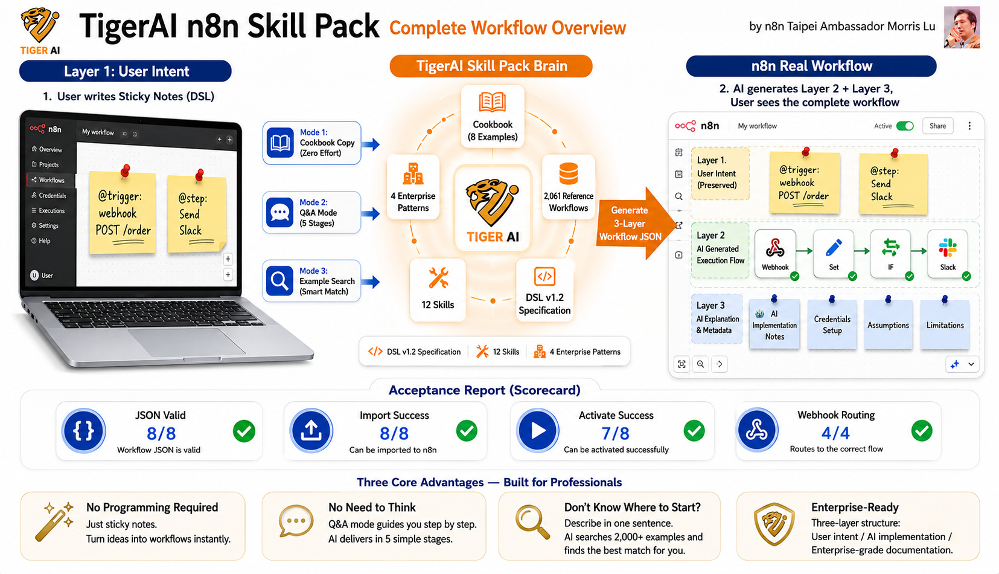

# TigerAI n8n Skill Pack — User Manual

> 🌐 **English** | [繁體中文](README.zh.md)

> Describe what you want in plain language (like talking to a coworker), and AI generates a complete n8n workflow for you.
> No coding required.



> 📊 **The whole pack in one picture**: User writes yellow sticky notes (Layer 1 intent) → TigerAI Skill Pack brain (Cookbook + 2,061 reference workflows + DSL v1.2 + 12 skills + 4 enterprise patterns) → Three-layer workflow JSON (real n8n workflow). Three features, zero learning curve.
> *by n8n Taipei Ambassador Morris Lu*

---

## 🤖 This is an Agentic Engineering Example

> **This entire project was authored using AI Agentic IDEs (Antigravity / Claude Code) — from spec to n8n workflows, every artifact was produced through human-AI agent collaboration.**

This Skill Pack is itself a working demo of **Agentic Engineering**:

| Dimension | Traditional way | This project (Agentic) |
|---|---|---|
| **Spec writing** | Engineer types every word | Chat with AI → AI produces SDD (Spec-Driven Design) |
| **n8n workflow dev** | Drag nodes on canvas | Write a yellow sticky note → AI emits runnable JSON |
| **Skill / plugin authoring** | Read docs, copy templates | Claude Code Skills + Antigravity `.agent/workflows/` orchestration |
| **Acceptance testing** | Run cases by hand, write report | AI runs 8 scenarios → auto-emits [`tests/REPORT-3.en.md`](tests/REPORT-3.en.md) |
| **Docs / README / CHANGELOG** | Backfilled after coding | Generated alongside code |
| **Third-party license compliance** | Manual review | AI detects leaked secrets, scrubs them, generates `THIRD_PARTY_NOTICES.md` |

### Agentic footprints in this repo

- **`skills/`** — 13 Claude Code / Antigravity skills; each `SKILL.md` is co-authored by humans and AI
- **`.agent/workflows/`** — Antigravity-native agentic workflows (e.g. `/install-n8n-pack` one-shot installer)
- **`cookbook/`** — 8 natural-language → workflow examples showing how to "talk to" the AI
- **`spec/sticky-note-three-layer.md`** — Three-layer structure spec that forces reviewable AI output
- **`research/patterns.md`** — 7 canonical skeletons + anti-patterns mined by AI from 2,061 real workflows
- **`reference-workflows/`** — AI training corpus ([Zie619/n8n-workflows](https://github.com/Zie619/n8n-workflows), MIT, secrets scrubbed)

### Who should study this project

- Developers / PMs learning **how to use an AI agent as an engineering teammate**
- Teams evaluating **whether Antigravity / Claude Code can replace hand-written skills / workflows**
- Anyone curious **what real human-AI co-authored engineering output looks like**

> 💡 In other words: this isn't just "a Skill Pack for n8n" — it's also an open **case study of how AI agents build a real product**.

### 👥 You (the user) can build n8n workflows the same way

**Once you install this Skill Pack, you can author your own n8n workflows with the same agentic approach** — no node syntax to learn, no code to write:

| Tool | What you do | What the AI does |
|---|---|---|
| **Antigravity** | Open your n8n project in Antigravity, run `/install-n8n-pack`, then describe what you want in plain language | `.agent/workflows/` auto-reads your intent → emits workflow JSON → deploys via n8n API |
| **Claude Code (CLI / VS Code)** | Run `bash install.sh` (or `install.ps1`) in your working dir, then say "I want a workflow that…" | 13 skills auto-load → three-layer workflow produced → ready to import into n8n |
| **Any AI assistant (ChatGPT / Gemini)** | Paste an example from [`cookbook/`](cookbook/00-INDEX.en.md) as a few-shot prompt | Imitates the three-layer structure and emits a compliant workflow JSON |

**Typical interaction** (30-second mental model):

```text
You ──> AI: "Every weekday 9am, pull Shopify orders, build a daily
             report, email it to the boss; on failure post to Slack #ops"

AI ──> You: ✅ workflow.json generated (Schedule → Shopify → Code → Email + Error → Slack)
             ✅ Yellow sticky: your original requirement, preserved
             ✅ Blue sticky: which credentials, constraints, test method
             ✅ Deployed to your n8n via API, webhook URL: https://...
```

> 🎯 **The core idea**: Users don't need to understand n8n internals — they just need to "talk like a human" to the AI. The Skill Pack ensures the AI's output is spec-compliant, reviewable, and maintainable.

See [`02-USAGE-MODES.en.md`](02-USAGE-MODES.en.md) for the three usage modes and [`03-FIRST-WORKFLOW.en.md`](03-FIRST-WORKFLOW.en.md) for a 15-minute hands-on walkthrough.

---

## 📖 Reading order (strongly recommended)

| # | File | Audience / Time |
|---|---|---|
| 0️⃣ | **This README.md** | Overview, start here (5 min) |
| 1️⃣ | [`01-INSTALL.en.md`](01-INSTALL.en.md) | First-time setup (10 min) |
| 2️⃣ | [`02-USAGE-MODES.en.md`](02-USAGE-MODES.en.md) | Pick your usage style (5 min) |
| 3️⃣ | [`03-FIRST-WORKFLOW.en.md`](03-FIRST-WORKFLOW.en.md) | Hands-on: build your first workflow (15 min) |
| 4️⃣ | [`04-FAQ.en.md`](04-FAQ.en.md) | Reference when stuck |

---

## ⚡ Understand it in 90 seconds

### What it does

You drop a **yellow sticky note** on the n8n canvas and write (in any language):

```text
Every day at 9 AM, fetch sales data and email the daily report to my boss.
On failure, notify Slack #ops.
```

You ask AI to build it. The canvas now shows a complete workflow:

```
┌─ Yellow sticky: your requirement (preserved as-is)
├─ Middle: AI-generated nodes (Schedule → HTTP → Code → Email)
└─ Blue sticky: AI's notes (credentials needed, assumptions, limitations, how to test)
```

No code. No syntax to learn. No need to memorize n8n node names.

### Three usage modes (details in [02-USAGE-MODES.en.md](02-USAGE-MODES.en.md))

| Mode | When | Trigger phrase |
|---|---|---|
| 🪄 Cookbook copy | You know what you want, fast | Copy from [cookbook](cookbook/00-INDEX.en.md) |
| 💬 Q&A mode | You have no idea how to describe it | "enable Q&A mode" / "問答模式" |
| 🔍 Example finder | Want to see prior art first | "find examples for X" / "範例查詢" |

---

## 📂 Pack contents

```text
TigerAI-n8n-Skill-Pack/
├── README.md / README.zh.md ← You are here
├── 01-INSTALL.md/.en.md       ← Install
├── 02-USAGE-MODES.md/.en.md   ← Three usage modes
├── 03-FIRST-WORKFLOW.md/.en.md ← Hands-on tutorial
├── 04-FAQ.md/.en.md           ← Common questions
│
├── cookbook/                  ← 8 copy-paste recipes (each has plain-language + DSL fold)
│   └── 00-INDEX.md/.en.md
│
├── skills/                    ← 13 Skills loaded by AI assistant
│   ├── _vendor/                  7 official n8n-skills (MIT)
│   └── tigerai/                  6 TigerAI custom (incl. AG Auto-Install)
│
├── spec/                      ← Technical specs (for engineers)
├── examples/tigerai-flagship/ ← 3 enterprise-grade examples (with SDD)
├── reference-workflows/       ← 2,061 public workflows (AI corpus)
├── research/                  ← Research artifacts
├── tests/                     ← Three rounds of acceptance reports
│
├── CHANGELOG.md / VERSION
├── install.sh / install.ps1   ← Install scripts (Supports Claude Code & Antigravity)
├── .agent/workflows/          ← Antigravity-exclusive workflows (e.g., /install-n8n-pack)
└── plugin.json                ← Skill manifest
```

---

## 🎯 Suggested reading paths by role

### I'm new to n8n (never built a workflow)
1. This file → `01-INSTALL.en.md` → `03-FIRST-WORKFLOW.en.md`
2. After your first workflow runs, browse `cookbook/00-INDEX.en.md` for your scenario
3. Stuck? → `04-FAQ.en.md`

### I'm experienced with n8n, evaluating this Pack
1. This file → `02-USAGE-MODES.en.md`
2. Read `tests/REPORT-3.md`: real n8n acceptance scores
3. Browse `examples/tigerai-flagship/`: enterprise-grade SDD examples

### I'm an engineer / integrator
1. This file → `spec/sticky-note-three-layer.md` + `spec/sticky-note-dsl.md`
2. `skills/tigerai/sticky-note-to-workflow/SKILL.md`: the core executor
3. `skills/tigerai/n8n-api-bridge/SKILL.md`: n8n REST API SOP
4. `research/patterns.md`: 7 standard skeletons + anti-patterns

### I'm distributing this to my team
1. This file → run `01-INSTALL.en.md` end-to-end
2. Read `04-FAQ.en.md` to prepare for team questions
3. Hand the entire folder to teammates and ask them to start at this README

---

## ✨ The three-layer structure (one diagram)

```text
┌─────────────────────────────────────────────────────┐
│ 🟡 Layer 1 (yellow sticky): User intent              │
│    "Every day at 9 AM..."                            │
│    ← AI never modifies this. Always the source of    │
│      truth.                                          │
├─────────────────────────────────────────────────────┤
│    Layer 2: AI-generated nodes & connections        │
│    Schedule → HTTP → Code → Email                   │
├─────────────────────────────────────────────────────┤
│ 🔵 Layer 3 (blue sticky): AI's commentary            │
│    • Why each node was chosen                        │
│    • Required credentials                            │
│    • Assumptions and known limits                    │
│    • How to test                                     │
└─────────────────────────────────────────────────────┘
```

---

## 🛠️ Pain points this Pack solves

| Pain | Solution |
|---|---|
| AI-written workflows are inconsistent, hard to review | Enforce three-layer structure |
| Users don't know how to describe what they want | Plain-language stickies + 8 cookbooks + Q&A mode |
| AI doesn't know n8n well enough | 7 official Skills + 2,061 workflow corpus |
| No enterprise-grade patterns | 4 pillars: Atomic Orchestration / Universal Worker / SDD / Security |
| Don't know where to start | `03-FIRST-WORKFLOW.en.md` 15-min hands-on |

---

## 📊 Real-environment acceptance results (v0.9.0 R3)

Tested 8 scenarios on a real n8n 2.10.3 + Postgres setup:

| Layer | Pass rate |
|---|---|
| JSON parse | 8/8 (100%) |
| n8n CLI Import | 8/8 (100%) |
| API Activate | 7/8 (87.5%) — T3 blocked by real Telegram bot token check |
| Webhook routing | 4/4 (100%) |
| Full execute success | 2/4 (with `continueOnFail` design) |

Details: [`tests/REPORT-3.en.md`](tests/REPORT-3.en.md).

---

## 🔢 Version & changelog

Current version: see [`VERSION`](VERSION). All changes: [`CHANGELOG.md`](CHANGELOG.md).

---

## 📜 License

- `skills/_vendor/`: MIT — from [czlonkowski/n8n-skills](https://github.com/czlonkowski/n8n-skills), see `skills/_vendor/LICENSE`
- `reference-workflows/`: MIT — from [Zie619/n8n-workflows](https://github.com/Zie619/n8n-workflows). API tokens, bearer tokens, and other secrets present in the original files have been replaced with placeholders (e.g. `YOUR_API_TOKEN_HERE`) before redistribution.
- The rest (TigerAI-authored skills, cookbook, specs, docs, install scripts): **TigerAI Proprietary** (distribution terms set by your company)

Full third-party notices: [`THIRD_PARTY_NOTICES.md`](THIRD_PARTY_NOTICES.md).

---

## 🆘 Stuck?

Tell Claude / ChatGPT:

> "I'm new to this. Following the TigerAI Skill Pack README, currently on [filename], hit [problem]."

The AI will diagnose. Or check [`04-FAQ.en.md`](04-FAQ.en.md) first.
